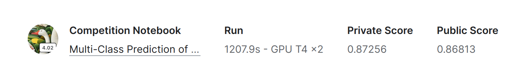

# dockerized-flask-app-for-multiclass-obesity-risk-prediction  

A Flask app is to predict a obesity risk from a given input. The machine model was trained on data posted on https://www.kaggle.com/competitions/playground-series-s4e2. The model is a Pytorch model saved. 

The concerning notebook can be found https://www.kaggle.com/code/yamurgle/obesityriskneuralnetworkpytorch. My model scored over
86% accuracy. 



## Routes
API endpoints are  like in the below: 
```bash
$ flask routes
Endpoint  Methods  Rule                   
--------  -------  -----------------------
index     GET      /                      
predict   POST     /predict               
static    GET      /static/<path:filename>
```

## Click command-line tools to create helpful JSON files
```bash
Commands:
  create-json
  create-map
```

## About Dataset and Preprocessing 

The obesity risk has seven different levels including:Insufficient Weight, Normal Weight, Overweight Level I, Overweight Level II, Obesity Type I, Obesity Type II and Obesity Type III. The label column is NObeyesdad. The other columns are features used for training. The number of features is 16, excluding 

```python 
Index(['Gender', 'Age', 'Height', 'Weight', 'family_history_with_overweight',
       'FAVC', 'FCVC', 'NCP', 'CAEC', 'SMOKE', 'CH2O', 'SCC', 'FAF', 'TUE',
       'CALC', 'MTRANS', 'NObeyesdad'],
      dtype='object')
17
```
The first five rows belonging to train.csv. The training dataset has 20758 samples. The 20 percent of training data is splitted into the validation data. The test data has 13840 rows. 
```python
   id  Gender        Age    Height      Weight  ...       FAF       TUE       CALC                 MTRANS           NObeyesdad
0   0    Male  24.443011  1.699998   81.669950  ...  0.000000  0.976473  Sometimes  Public_Transportation  Overweight_Level_II
1   1  Female  18.000000  1.560000   57.000000  ...  1.000000  1.000000         no             Automobile        Normal_Weight
2   2  Female  18.000000  1.711460   50.165754  ...  0.866045  1.673584         no  Public_Transportation  Insufficient_Weight
3   3  Female  20.952737  1.710730  131.274851  ...  1.467863  0.780199  Sometimes  Public_Transportation     Obesity_Type_III
4   4    Male  31.641081  1.914186   93.798055  ...  1.967973  0.931721  Sometimes  Public_Transportation  Overweight_Level_II
```
The dictionary structure below is used to check the data sent is in a proper format for the prediction. All data having interval is numericak while the others are categorical data. The categorical data should be encoded as numerical like in the below:

```python
{'Gender': {'Male': 0, 'Female': 1}, 
'Age': {'interval': [14.0, 61.0]}, 
'Height': {'interval': [1.45, 1.975663]}, 
'Weight': {'interval': [39.0, 165.057269]}, 
'family_history_with_overweight': {'yes': 0, 'no': 1}, 
'FAVC': {'yes': 0, 'no': 1}, 'FCVC': {'interval': [1.0, 3.0]}, 
'NCP': {'interval': [1.0, 4.0]}, 
'CAEC': {'Sometimes': 0, 'Frequently': 1, 'no': 2, 'Always': 3}, 
'SMOKE': {'no': 0, 'yes': 1}, 
'CH2O': {'interval': [1.0, 3.0]}, 
'SCC': {'no': 0, 'yes': 1}, 
'FAF': {'interval': [0.0, 3.0]}, 
'TUE': {'interval': [0.0, 2.0]}, 
'CALC': {'Sometimes': 0, 'no': 1, 'Frequently': 2}, 
'MTRANS': {'Public_Transportation': 0, 'Automobile': 1, 'Walking': 2, 'Motorbike': 3, 'Bike': 4}, 
'NObeyesdad': {'Overweight_Level_II': 0, 'Normal_Weight': 1, 'Insufficient_Weight': 2, 'Obesity_Type_III': 3, 'Obesity_Type_II': 4, 'Overweight_Level_I': 5, 'Obesity_Type_I': 6}}
```
After prediction, the prediction is converted to the categorical data according to the dictionary below:

```python
{"NObeyesdad": {"0": "Overweight_Level_II", "1": "Normal_Weight", "2": "Insufficient_Weight", "3": "Obesity_Type_III", "4": "Obesity_Type_II", "5": "Overweight_Level_I", "6": "Obesity_Type_I"}}
```


